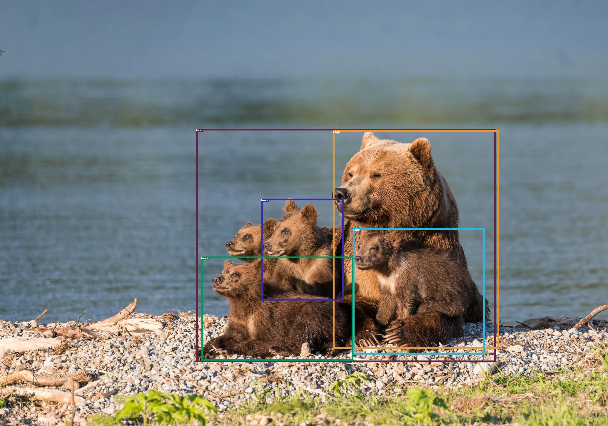

# Object detection using "image-prompts" using Simple Open-Vocabulary Object Detection with Vision Transformers

An interesting demo using [OWL-ViT](https://arxiv.org/abs/2205.06230) of Google from huggingface

## Use case
- Image-conditioned detection and Text-condition detection

## Catelog
- [x] Image-conditioned detection
- [x] [Huggingface Demo](https://huggingface.co/spaces/ngthanhtinqn/Segment_Anything_With_OWL-ViT)

## Installation
The code requires `python>=3.8`, as well as `pytorch>=1.7` and `torchvision>=0.8`. Please follow the instructions [here](https://pytorch.org/get-started/locally/) to install both PyTorch and TorchVision dependencies. Installing both PyTorch and TorchVision with CUDA support is strongly recommended.


Install OWL-ViT (the OWL-ViT is included in transformer library):

```bash
pip install transformer
```

## Run Demo

- Run demo
```bash
bash run_demo_image_conditioned.sh
```


## Reference
Please give applause for [OWL-ViT on HuggingFace](https://huggingface.co/spaces/adirik/OWL-ViT)


## Citation
If you find this project helpful for your research, please consider citing the following BibTeX entry.
```BibTex

@misc{minderer2022simple,
      title={Simple Open-Vocabulary Object Detection with Vision Transformers}, 
      author={Matthias Minderer and Alexey Gritsenko and Austin Stone and Maxim Neumann and Dirk Weissenborn and Alexey Dosovitskiy and Aravindh Mahendran and Anurag Arnab and Mostafa Dehghani and Zhuoran Shen and Xiao Wang and Xiaohua Zhai and Thomas Kipf and Neil Houlsby},
      year={2022},
      eprint={2205.06230},
      archivePrefix={arXiv},
      primaryClass={cs.CV}
}
```